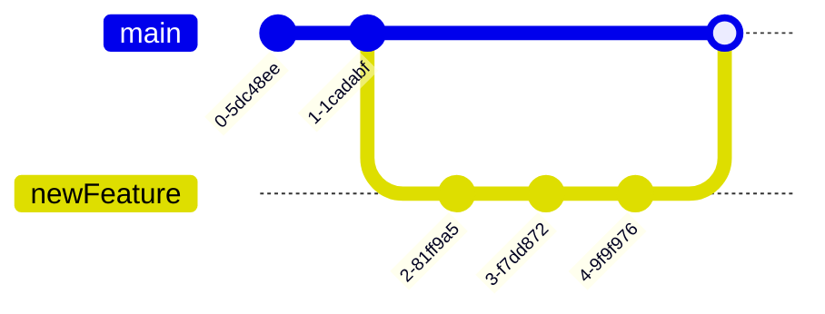

# Git rebase workflow

## Tại sao nên dùng `rebase`?

`Rebase` là một trong số các git command có khả năng tích hợp các thay đổi từ một branch vào một branch khác, khá giống với merge, tuy nhiên nó sẽ không tạo ra merge commit

`Rebase` sẽ rewrite lại git commit history, cho nên đây là một command khá rủi ro nếu bất cẩn khi sử dụng

Với `rebase` ta có thể `squash` các commit, gộp nhiều commit lại thành một (hoặc nhiều) commit. Ta có thể sử dụng `squash` khi một bug hay feature được fix/phát triển dưới nhiều commit khác nhau, khi đẩy lên production, ta muốn gộp chung chúng thành một commit duy nhất.

Dưới là Git commit tree

Nếu ta thực hiện merge toàn bộ nhánh `newFeature` vào nhánh `main` thì nhánh `main` sẽ hiển thị toàn bộ commit của nhánh `newFeature` (khuyến mãi thêm 1 merge commit). Điều này về lâu dài sẽ làm cho git tree rất rối.

Thay vì vậy, ta `squash` toàn bộ commit của nhánh `newFeature` thành 1 commit rồi thực hiện `rebase` vào nhánh `main` thì git tree của main sẽ có một commit duy nhất ( hoặc 2 nếu tính cả merge commit khi sử dụng merge)